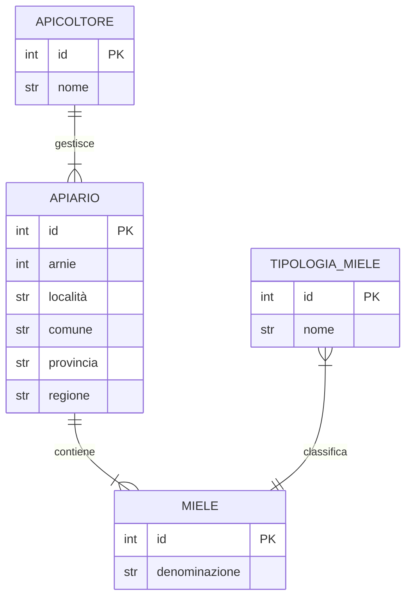

# ESERCIZIO 1

```mermaid

erDiagram

    APIARIO ||--|{ MIELE : contiene
    TIPOLOGIA_MIELE }|--|| MIELE : classifica    
    APICOLTORE ||--|{ APIARIO : gestisce

    APIARIO {
        int id PK
        int arnie
        str località
        str comune
        str provincia
        str regione
    } 
    

    
    MIELE {
        int id PK
        str denominazione

        
    }
 

    APICOLTORE {

        int id PK
        str nome


    }
    TIPOLOGIA_MIELE{

        int id PK
        str nome
    }

```
