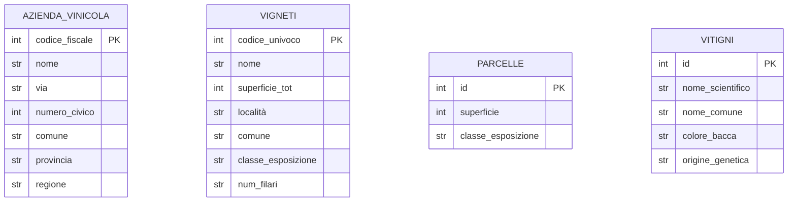

# Esercizio 1

I vitigni sono piantati a livello di blocco: per ogni blocco si specifica quali vitigni vi sono coltivati e, per ciascuno, la percentuale della superficie del blocco occupata dal vitigno. Questa struttura permette composizioni diverse tra blocchi dello stesso vigneto.

Le etichette di vino rappresentano l'unità di produzione commerciale: ogni etichetta ha nome, annata e tipologia (es: "DOC", "IGT", "Vino da Tavola"). Un'etichetta è prodotta da un'azienda, proviene da un vigneto principale e può essere associata a un vitigno prevalente.
