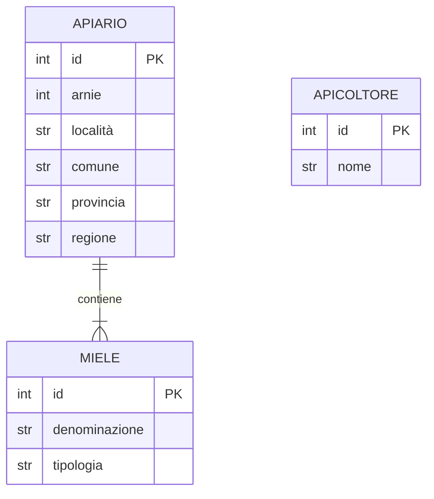

# ESERCIZIO 1

```mermaid
erDiagram

    APIARIO ||--|{ MIELE : contiene
         

    APIARIO {
        int id PK
        int arnie
        str località
        str comune
        str provincia
        str regione
    } 
    

    
    MIELE {
        int id PK
        str denominazione
        str tipologia

        
    }
 

    APICOLTORE {

        int id PK
        str nome


    }

```

